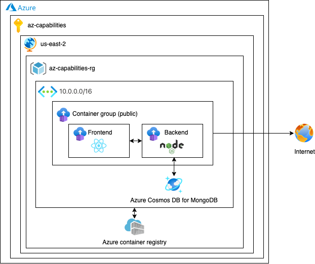

# Event Manager - Azure Architecture

## Architecture Decisions Record (ADR)

### Infrastructure

#### Version 1

#### Version 2

### Resources

* Subscription
  * App registration
  * Azure Active Directory
  * Resource Group
    * Virtual Network
    * Container Registry
    * Container group: 3 Container Instances
    * Load Balancer
    * Public Ip
    * Storage Account for Container
    * Azure Monitor
    * Azure Log Workspace
    * Storage Account for Logging

### Infrastructure Cost

Cost per month for 24 hours:

* Virtual Network: 7 USD
* Container Registry: 5 USD
* Container group: 32.81 USD
* Load Balancer: 23.25 USD
* Public Ip: 3.65 USD
* Azure Monitor: 16.84 USD
* Storage Account for Container: 5.81 USD
* Storage Account for Logging: 5.81 USD

**Total cost: 100.16 USD**

**Azure Calculator:** https://azure.com/e/b81a8c974e1c4eee8516fd5a970ffabc