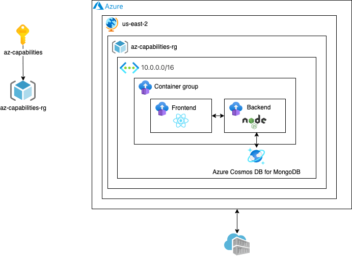

# Azure Architecture

## Infrastructure

* Virtual Network
* Container Instances
* CosmosDB for MongoDB
* Load Balancer
* Container Registry

## Infrastructure Cost

Costo por mes durante 24 horas:

* Virtual Network: 4 USD
* Container Instance: 32.81 USD  - 1 Container group: 2 instances
* CosmosDB for MongoDB: 23.36 USD - Standard provisioned throughput
* Load Balancer: 0 USD
* Azure Container Registry: 5 USD - Basic Tier

**Total cost: 272,83 USD**

**Azure Calculator:** https://azure.com/e/b40d08f1816648fe93622ea4af4d6c74