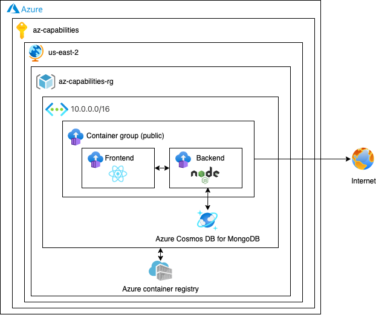

# Azure Architecture

## Infrastructure

* Subscription
  * App registration
  * Azure Active Directory
  * Resource Group
    * Virtual Network
    * Container Registry
    * Container group: 3 Container Instances
    * Load Balancer
    * Public Ip
    * Storage Account

## Infrastructure Cost

Costo por mes durante 24 horas:

* Virtual Network: 7 USD
* Container Registry: 5 USD
* Container group: 32.81 USD
* Load Balancer: 23.25 USD
* Public Ip: 3.65 USD
* Storage Account: 5.81 USD

**Total cost: 77.52 USD**

**Azure Calculator:** https://azure.com/e/c7787cbc39e44ecaaed1c37f1f43c34a